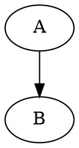

# @helping-ai-workflow/md2doc

> Markdown → HTML / PDF renderer with WaveDrom, Mermaid, and Graphviz support.

Two global CLIs (`md2html`, `md2pdf`) you can call from any directory.

## Install

Requires Node.js 18 or higher. The first install pulls puppeteer (≈ 170 MB Chromium download); subsequent installs reuse it.

### Recommended: install via nvm

If you do not yet have Node.js — or your system Node lives under `/usr/local` and `npm install -g` fails with `EACCES` — install Node through [nvm](https://github.com/nvm-sh/nvm) first. nvm puts Node under `~/.nvm`, so global packages never need `sudo`.

```bash
sudo apt install -y curl     # Debian / Ubuntu only; skip if curl is already installed
curl -o- https://raw.githubusercontent.com/nvm-sh/nvm/master/install.sh | bash
source ~/.zshrc              # or: source ~/.bashrc
nvm install --lts
nvm use --lts
npm install -g @helping-ai-workflow/md2doc
```

### Already have Node.js

```bash
npm install -g @helping-ai-workflow/md2doc
```

### Troubleshooting

**`EACCES: permission denied, mkdir '/usr/local/lib/node_modules'`**
Your system Node is owned by root. Do **not** run `sudo npm install -g` — puppeteer's postinstall would download Chromium as root and break later runs. Instead, switch to nvm using the steps above.

**`Failed to set up chrome ...! Set "PUPPETEER_SKIP_DOWNLOAD" env variable to skip download.`**
An earlier install left a half-finished Chromium download in `~/.cache/puppeteer`. md2doc ≥ 1.0.3 cleans this automatically; on older versions, clear the cache and retry:

```bash
rm -rf ~/.cache/puppeteer
npm install -g @helping-ai-workflow/md2doc
```

## Usage

```bash
md2html foo.md                     # → foo.html (next to source)
md2html foo.md bar.md              # batch render
md2html foo.md --out custom.html   # explicit output (single-file mode)
md2html foo.md --open              # render then launch viewer
md2html foo.md --quiet             # suppress progress output
```

`md2pdf` accepts the same four flags with PDF-output semantics.

### Flags

| Flag | Meaning |
|---|---|
| `--out <path>` | Explicit output path. Only valid with exactly one input. |
| `--open` | Launch the platform viewer (`xdg-open` / `open` / `start`) after render. |
| `--quiet` | Suppress per-file progress messages. |
| `--version`, `-v` | Print version. |
| `--help`, `-h` | Print help. |

## Supported diagram types

Embedded in fenced code blocks inside your Markdown:

````markdown


```wavedrom
{ "signal": [...] }
```


````

Diagrams render directly in the output (HTML or PDF).

## Why a global CLI

Multiple repos used to ship copies of this script. They drifted. This package centralises the renderer so every repo references the same version. See [`docs/why.md`](https://github.com/helping-ai-workflow/md2doc) for background.

## Licence

MIT.
