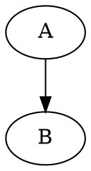

# @helping-ai-workflow/md2doc

> Markdown → HTML / PDF renderer with WaveDrom, Mermaid, and Graphviz support.

Two global CLIs (`md2html`, `md2pdf`) you can call from any directory.

## Install

```bash
npm install -g @helping-ai-workflow/md2doc
```

Requires Node.js 18 or higher. The first install pulls puppeteer (≈ 170 MB Chromium download); subsequent installs reuse it.

## Usage

```bash
md2html foo.md                     # → foo.html (next to source)
md2html foo.md bar.md              # batch render
md2html foo.md --out custom.html   # explicit output (single-file mode)
md2html foo.md --open              # render then launch viewer
md2html foo.md --quiet             # suppress progress output
```

`md2pdf` accepts the same four flags with PDF-output semantics.

### Flags

| Flag | Meaning |
|---|---|
| `--out <path>` | Explicit output path. Only valid with exactly one input. |
| `--open` | Launch the platform viewer (`xdg-open` / `open` / `start`) after render. |
| `--quiet` | Suppress per-file progress messages. |
| `--version`, `-v` | Print version. |
| `--help`, `-h` | Print help. |

## Supported diagram types

Embedded in fenced code blocks inside your Markdown:

````markdown


```wavedrom
{ "signal": [...] }
```


````

Diagrams render directly in the output (HTML or PDF).

## Why a global CLI

Multiple repos used to ship copies of this script. They drifted. This package centralises the renderer so every repo references the same version. See [`docs/why.md`](https://github.com/helping-ai-workflow/md2doc) for background.

## Licence

MIT.
