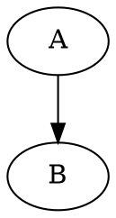

# @helping-ai-workflow/md2doc

> Markdown → HTML / PDF renderer with WaveDrom, Mermaid, and Graphviz support.

A single global CLI (`md2doc`) you can call from any directory.

## Install

Requires Node.js 18 or higher. The first install pulls puppeteer (≈ 170 MB Chromium download); subsequent installs reuse it.

Chromium is only needed for **PDF export** and the optional `--bake-svg` flag. HTML diagram rendering needs nothing extra — Graphviz runs in-process via WebAssembly, and Mermaid / WaveDrom are bundled and inlined, so diagrams render **offline with no system Graphviz and no CDN**.

### Recommended: install via nvm

If you do not yet have Node.js — or your system Node lives under `/usr/local` and `npm install -g` fails with `EACCES` — install Node through [nvm](https://github.com/nvm-sh/nvm) first. nvm puts Node under `~/.nvm`, so global packages never need `sudo`.

```bash
sudo apt install -y curl     # Debian / Ubuntu only; skip if curl is already installed
curl -o- https://raw.githubusercontent.com/nvm-sh/nvm/master/install.sh | bash
source ~/.zshrc              # or: source ~/.bashrc
nvm install --lts
nvm use --lts
npm install -g @helping-ai-workflow/md2doc
```

### Already have Node.js

```bash
npm install -g @helping-ai-workflow/md2doc
```

### Troubleshooting

**`EACCES: permission denied, mkdir '/usr/local/lib/node_modules'`**
Your system Node is owned by root. Do **not** run `sudo npm install -g` — puppeteer's postinstall would download Chromium as root and break later runs. Instead, switch to nvm using the steps above.

**`Failed to set up chrome ...! Set "PUPPETEER_SKIP_DOWNLOAD" env variable to skip download.`**
An earlier install left a half-finished Chromium download in `~/.cache/puppeteer`. md2doc ≥ 1.0.3 cleans this automatically; on older versions, clear the cache and retry:

```bash
rm -rf ~/.cache/puppeteer
npm install -g @helping-ai-workflow/md2doc
```

## Usage

```bash
md2doc foo.md                              # render HTML to OS temp dir, open viewer
md2doc --pdf foo.md                        # render PDF instead
md2doc --html --pdf foo.md                 # render both formats
md2doc *.md                                # batch: each file → temp + open

md2doc foo.md --out bar.html               # write to a specific file (no auto-open)
md2doc foo.md --out report.pdf             # --pdf inferred from the extension
md2doc foo.md --out ./build/               # write to ./build/foo.html (no auto-open)
md2doc *.md --out ./build/                 # batch into ./build/
md2doc foo.md --out ./build/ --open        # explicit open with --out
```

By default, `md2doc` writes to your OS temp directory and launches the platform viewer.
Pass `--out <path>` to write somewhere specific; doing so disables auto-open unless you
also pass `--open`.

### Flags

| Flag | Meaning |
|---|---|
| `--html` | Render HTML (default when neither `--html`/`--pdf` nor a `.pdf` file `--out` is given; directory targets always default to HTML). |
| `--pdf` | Render PDF. Combine with `--html` to render both. |
| `--out <path>` | Output path. Ends with `/` or an existing directory → directory mode. Ends with `.html` / `.pdf` → file mode (single input only). Without `--html`/`--pdf`, the extension selects the format. Implies `--no-open` unless `--open` is also passed. |
| `--open` | Launch the platform viewer (`xdg-open` / `open` / `start`) after render. Default when `--out` is absent. |
| `--no-open` | Skip the viewer launch. |
| `--quiet` | Suppress per-file progress messages. |
| `--bake-svg` | Pre-render Mermaid / WaveDrom to inert SVG at generation time (HTML output only; needs Chromium). The output then contains no diagram JavaScript. |
| `--version`, `-v` | Print version. |
| `--help`, `-h` | Print help. |

### Migration from md2html / md2pdf (v1.x → v2.0.0)

| Old | New |
|---|---|
| `md2html foo.md` | `md2doc foo.md` |
| `md2pdf foo.md` | `md2doc --pdf foo.md` |
| `md2html foo.md --out f.html` | `md2doc foo.md --out f.html` |
| `md2html foo.md --open` | `md2doc foo.md` (open is default) |
| `md2html *.md` (output next to source) | `md2doc *.md --out ./build/` (or accept temp output) |

## Supported diagram types

Embedded in fenced code blocks inside your Markdown:

````markdown

```mermaid
graph LR
A --> B
```

```wavedrom
{ "signal": [...] }
```


```dot
digraph G { A -> B }
```
````

All three render directly in the output (HTML or PDF), **offline and with no system dependencies**: Graphviz `dot` runs in-process via WebAssembly (no system `dot` binary required), and Mermaid / WaveDrom are bundled and inlined (no CDN). Each engine's runtime is embedded only when the document actually uses that diagram type.

By default, Mermaid and WaveDrom render in the browser when the HTML is opened; pass `--bake-svg` to pre-render them to inert SVG at generation time instead (Graphviz is always pre-rendered to SVG).

## Why a global CLI

Multiple repos used to ship copies of this script. They drifted. This package centralises the renderer so every repo references the same version. See [`docs/why.md`](https://github.com/helping-ai-workflow/md2doc) for background.

## Licence

MIT.
