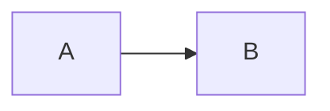
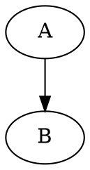

# @helping-ai-workflow/md2doc

> Markdown → HTML / PDF renderer with WaveDrom, Mermaid, and Graphviz support.

A single global CLI (`md2doc`) you can call from any directory.

## Install

Requires Node.js 18 or higher. The first install pulls puppeteer (≈ 170 MB Chromium download); subsequent installs reuse it.

Chromium is only needed for **PDF export** and the optional `--bake-svg` flag. HTML diagram rendering needs nothing extra — Graphviz runs in-process via WebAssembly, and Mermaid / WaveDrom are bundled and inlined, so diagrams render **offline with no system Graphviz and no CDN**.

### Recommended: install via nvm

If you do not yet have Node.js — or your system Node lives under `/usr/local` and `npm install -g` fails with `EACCES` — install Node through [nvm](https://github.com/nvm-sh/nvm) first. nvm puts Node under `~/.nvm`, so global packages never need `sudo`.

```bash
sudo apt install -y curl     # Debian / Ubuntu only; skip if curl is already installed
curl -o- https://raw.githubusercontent.com/nvm-sh/nvm/master/install.sh | bash
source ~/.zshrc              # or: source ~/.bashrc
nvm install --lts
nvm use --lts
npm install -g @helping-ai-workflow/md2doc
```

### Already have Node.js

```bash
npm install -g @helping-ai-workflow/md2doc
```

### Troubleshooting

**`EACCES: permission denied, mkdir '/usr/local/lib/node_modules'`**
Your system Node is owned by root. Do **not** run `sudo npm install -g` — puppeteer's postinstall would download Chromium as root and break later runs. Instead, switch to nvm using the steps above.

**`Failed to set up chrome ...! Set "PUPPETEER_SKIP_DOWNLOAD" env variable to skip download.`**
An earlier install left a half-finished Chromium download in `~/.cache/puppeteer`. md2doc ≥ 1.0.3 cleans this automatically; on older versions, clear the cache and retry:

```bash
rm -rf ~/.cache/puppeteer
npm install -g @helping-ai-workflow/md2doc
```

## Usage

```bash
md2doc foo.md                              # render HTML to OS temp dir, open viewer
md2doc --pdf foo.md                        # render PDF instead
md2doc --html --pdf foo.md                 # render both formats
md2doc *.md                                # batch: each file → temp + open

md2doc foo.md --out bar.html               # write to a specific file (no auto-open)
md2doc foo.md --out report.pdf             # --pdf inferred from the extension
md2doc foo.md --out ./build/               # write to ./build/foo.html (no auto-open)
md2doc *.md --out ./build/                 # batch into ./build/
md2doc foo.md --out ./build/ --open        # explicit open with --out
```

By default, `md2doc` writes to your OS temp directory and launches the platform viewer.
Pass `--out <path>` to write somewhere specific; doing so disables auto-open unless you
also pass `--open`.

### Flags

| Flag | Meaning |
|---|---|
| `--html` | Render HTML (default when neither `--html`/`--pdf` nor a `.pdf` file `--out` is given; directory targets always default to HTML). |
| `--pdf` | Render PDF. Combine with `--html` to render both. |
| `--out <path>` | Output path. Ends with `/` or an existing directory → directory mode. Ends with `.html` / `.pdf` → file mode (single input only). Without `--html`/`--pdf`, the extension selects the format. Implies `--no-open` unless `--open` is also passed. |
| `--open` | Launch the platform viewer (`xdg-open` / `open` / `start`) after render. Default when `--out` is absent. |
| `--no-open` | Skip the viewer launch. |
| `--quiet` | Suppress per-file progress messages. |
| `--bake-svg` | Pre-render Mermaid / WaveDrom to inert SVG at generation time (HTML output only; needs Chromium). The output then contains no diagram JavaScript. |
| `--version`, `-v` | Print version. |
| `--help`, `-h` | Print help. |

### Images

Local images referenced from the markdown are resolved against the **markdown file's own
directory** and inlined into the output as base64 `data:` URIs, so the rendered HTML / PDF
stays self-contained wherever it is written (the OS temp dir by default) and however it is
later copied or mailed.

```markdown
        <!-- inlined -->
  <!-- inlined, attributes preserved -->
      <!-- left as a remote URL -->
```

`srcset` and `<source>` inside `<picture>` are inlined too. Only known image
extensions are inlined, so `` is left alone rather than
base64'd into a document you may be about to share.

A reference with no file on disk keeps its original `src` and prints
`[WARN] image not found, left as-is: ...` on stderr; the render still succeeds.

Each reference carries its own copy of the payload, so re-using one large diagram
in several places grows the HTML accordingly. PDF output is unaffected.

### Viewing diagrams

Click any image, Mermaid, Graphviz or WaveDrom graphic in the rendered HTML to open it
full-screen.

| Input | Action |
|---|---|
| Wheel / shift+wheel | Scroll vertically / horizontally |
| Ctrl (or ⌘) + wheel | Zoom around the pointer |
| Drag | Pan |
| `+` `-` | Zoom in / out |
| `0` `1` | Fit to window / actual size |
| Double-click | Toggle fit ↔ 100% |
| `Esc`, ✕, backdrop click | Close |

Vector diagrams open scaled to fill the window; raster images open at actual size. An
image wrapped in a link stays a link. The overlay is hidden in print and never reaches
the PDF output.

### Migration from md2html / md2pdf (v1.x → v2.0.0)

| Old | New |
|---|---|
| `md2html foo.md` | `md2doc foo.md` |
| `md2pdf foo.md` | `md2doc --pdf foo.md` |
| `md2html foo.md --out f.html` | `md2doc foo.md --out f.html` |
| `md2html foo.md --open` | `md2doc foo.md` (open is default) |
| `md2html *.md` (output next to source) | `md2doc *.md --out ./build/` (or accept temp output) |

## Editing (`--edit`)

```bash
md2doc --edit foo.md              # serve foo.md in the browser editor, open a tab
md2doc --edit foo.md bar.md       # one tab per file
md2doc --edit foo.md --port 4000  # pin the server to a specific port
md2doc --edit foo.md --no-open    # start the server without launching a browser tab
```

`--edit` starts a local (`127.0.0.1`-only) server and opens the rendered document in
your browser with a **✎** gutter button next to every top-level block (heading,
paragraph, table, code fence, list, blockquote, ...). Click it to edit that block's
raw Markdown source in place.

| Key / control | Action |
|---|---|
| **✎** gutter | Open that block's raw source for editing |
| `Ctrl`/`⌘` + `Enter`, or **✓** | Commit the edit and re-render the block |
| `Esc`, or **✕** | Cancel the edit, discard the change |
| `Ctrl`/`⌘` + `S` | Save the document to disk |
| `Ctrl`/`⌘` + `Z` | Undo the last committed edit |
| `Ctrl`/`⌘` + `Y` (or `Ctrl`/`⌘` + `Shift` + `Z`) | Redo |

**One editor open at a time.** Clicking a second block's gutter while another
block's editor is still open is refused; the already-open editor flashes so you
can find it. Commit or cancel it first.

**Save is explicit, not autosave**, and is guarded against clobbering changes made
outside the browser: each save carries the file's last-known modification time, and
if the file on disk has changed since the page loaded it (edited elsewhere, or saved
from another tab), the save is rejected with a conflict banner instead of silently
overwriting — reload the page to pick up the newer content, then re-apply your edit.
A failed render or save (e.g. the server process died, or invalid content) also
surfaces as a dismissible banner rather than silently doing nothing.

**Fidelity guarantee**: only the lines inside the block(s) you actually commit are
rewritten. Every other line — including whitespace-sensitive formatting like padded
table columns, trailing spaces, and the file's original EOF-newline state — is left
byte-for-byte untouched, whether you save with zero edits or after several.

**Known Phase-1 limitation**: if a committed edit introduces the *first* occurrence
of a diagram type (Mermaid or WaveDrom) that the document didn't already contain
when the page was loaded, that diagram library was never embedded into the page, so
the new block renders as raw source until you reload the browser tab (no need to
restart `md2doc --edit`). The same applies to math: if a committed edit introduces
the document's *first* `math` fence or `$…$`/`$$…$$` expression, the KaTeX
stylesheet was never injected into the page, so the new equation renders unstyled
(raw KaTeX markup, no CSS) until you reload the tab.

`--edit` does not support directory inputs yet (planned for a later phase) and
cannot be combined with `--html` / `--pdf` / `--out` / `--bake-svg`.

## Supported diagram types

Embedded in fenced code blocks inside your Markdown:

````markdown

```mermaid
graph LR
A --> B
```

```wavedrom
{ "signal": [...] }
```


```dot
digraph G { A -> B }
```
````

All three render directly in the output (HTML or PDF), **offline and with no system dependencies**: Graphviz `dot` runs in-process via WebAssembly (no system `dot` binary required), and Mermaid / WaveDrom are bundled and inlined (no CDN). Each engine's runtime is embedded only when the document actually uses that diagram type.

By default, Mermaid and WaveDrom render in the browser when the HTML is opened; pass `--bake-svg` to pre-render them to inert SVG at generation time instead (Graphviz is always pre-rendered to SVG).

## Why a global CLI

Multiple repos used to ship copies of this script. They drifted. This package centralises the renderer so every repo references the same version. See [`docs/why.md`](https://github.com/helping-ai-workflow/md2doc) for background.

## Licence

MIT.
