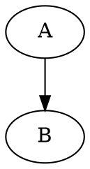

# @helping-ai-workflow/md2doc

> Markdown → HTML / PDF renderer with WaveDrom, Mermaid, and Graphviz support.

A single global CLI (`md2doc`) you can call from any directory.

## Install

Requires Node.js 18 or higher. The first install pulls puppeteer (≈ 170 MB Chromium download); subsequent installs reuse it.

Chromium is only needed for **PDF export** and the optional `--bake-svg` flag. HTML diagram rendering needs nothing extra — Graphviz runs in-process via WebAssembly, and Mermaid / WaveDrom are bundled and inlined, so diagrams render **offline with no system Graphviz and no CDN**.

### Recommended: install via nvm

If you do not yet have Node.js — or your system Node lives under `/usr/local` and `npm install -g` fails with `EACCES` — install Node through [nvm](https://github.com/nvm-sh/nvm) first. nvm puts Node under `~/.nvm`, so global packages never need `sudo`.

```bash
sudo apt install -y curl     # Debian / Ubuntu only; skip if curl is already installed
curl -o- https://raw.githubusercontent.com/nvm-sh/nvm/master/install.sh | bash
source ~/.zshrc              # or: source ~/.bashrc
nvm install --lts
nvm use --lts
npm install -g @helping-ai-workflow/md2doc
```

### Already have Node.js

```bash
npm install -g @helping-ai-workflow/md2doc
```

### Troubleshooting

**`EACCES: permission denied, mkdir '/usr/local/lib/node_modules'`**
Your system Node is owned by root. Do **not** run `sudo npm install -g` — puppeteer's postinstall would download Chromium as root and break later runs. Instead, switch to nvm using the steps above.

**`Failed to set up chrome ...! Set "PUPPETEER_SKIP_DOWNLOAD" env variable to skip download.`**
An earlier install left a half-finished Chromium download in `~/.cache/puppeteer`. md2doc ≥ 1.0.3 cleans this automatically; on older versions, clear the cache and retry:

```bash
rm -rf ~/.cache/puppeteer
npm install -g @helping-ai-workflow/md2doc
```

## Usage

```bash
md2doc foo.md                              # render HTML to OS temp dir, open viewer
md2doc --pdf foo.md                        # render PDF instead
md2doc --html --pdf foo.md                 # render both formats
md2doc *.md                                # batch: each file → temp + open

md2doc foo.md --out bar.html               # write to a specific file (no auto-open)
md2doc foo.md --out report.pdf             # --pdf inferred from the extension
md2doc foo.md --out ./build/               # write to ./build/foo.html (no auto-open)
md2doc *.md --out ./build/                 # batch into ./build/
md2doc foo.md --out ./build/ --open        # explicit open with --out
```

By default, `md2doc` writes to your OS temp directory and launches the platform viewer.
Pass `--out <path>` to write somewhere specific; doing so disables auto-open unless you
also pass `--open`.

### Flags

| Flag | Meaning |
|---|---|
| `--html` | Render HTML (default when neither `--html`/`--pdf` nor a `.pdf` file `--out` is given; directory targets always default to HTML). |
| `--pdf` | Render PDF. Combine with `--html` to render both. |
| `--out <path>` | Output path. Ends with `/` or an existing directory → directory mode. Ends with `.html` / `.pdf` → file mode (single input only). Without `--html`/`--pdf`, the extension selects the format. Implies `--no-open` unless `--open` is also passed. |
| `--open` | Launch the platform viewer (`xdg-open` / `open` / `start`) after render. Default when `--out` is absent. |
| `--no-open` | Skip the viewer launch. |
| `--quiet` | Suppress per-file progress messages. |
| `--bake-svg` | Pre-render Mermaid / WaveDrom to inert SVG at generation time (HTML output only; needs Chromium). The output then contains no diagram JavaScript. |
| `--version`, `-v` | Print version. |
| `--help`, `-h` | Print help. |

### Images

Local images referenced from the markdown are resolved against the **markdown file's own
directory** and inlined into the output as base64 `data:` URIs, so the rendered HTML / PDF
stays self-contained wherever it is written (the OS temp dir by default) and however it is
later copied or mailed.

```markdown
        <!-- inlined -->
  <!-- inlined, attributes preserved -->
      <!-- left as a remote URL -->
```

`srcset` and `<source>` inside `<picture>` are inlined too. Only known image
extensions are inlined, so `` is left alone rather than
base64'd into a document you may be about to share.

A reference with no file on disk keeps its original `src` and prints
`[WARN] image not found, left as-is: ...` on stderr; the render still succeeds.

Each reference carries its own copy of the payload, so re-using one large diagram
in several places grows the HTML accordingly. PDF output is unaffected.

### Viewing diagrams

Click any image, Mermaid, Graphviz or WaveDrom graphic in the rendered HTML to open it
full-screen.

| Input | Action |
|---|---|
| Wheel / shift+wheel | Scroll vertically / horizontally |
| Ctrl (or ⌘) + wheel | Zoom around the pointer |
| Drag | Pan |
| `+` `-` | Zoom in / out |
| `0` `1` | Fit to window / actual size |
| Double-click | Toggle fit ↔ 100% |
| `Esc`, ✕, backdrop click | Close |

Vector diagrams open scaled to fill the window; raster images open at actual size. An
image wrapped in a link stays a link. The overlay is hidden in print and never reaches
the PDF output.

### Migration from md2html / md2pdf (v1.x → v2.0.0)

| Old | New |
|---|---|
| `md2html foo.md` | `md2doc foo.md` |
| `md2pdf foo.md` | `md2doc --pdf foo.md` |
| `md2html foo.md --out f.html` | `md2doc foo.md --out f.html` |
| `md2html foo.md --open` | `md2doc foo.md` (open is default) |
| `md2html *.md` (output next to source) | `md2doc *.md --out ./build/` (or accept temp output) |

## Editing (`--edit`)

```bash
md2doc --edit foo.md              # serve foo.md in the browser editor, open a tab
md2doc --edit foo.md bar.md       # one tab per file
md2doc --edit foo.md --port 4000  # pin the server to a specific port
md2doc --edit foo.md --no-open    # start the server without launching a browser tab
```

`--edit` starts a local (`127.0.0.1`-only) server and opens the rendered document in
your browser. Click anywhere inside a paragraph, heading, list item, or table cell
to place your cursor and start typing directly — no separate "select then edit" step.
The block is live-marked as edited; focus leaving the block commits your changes
automatically. Press `Ctrl+S` to save to disk explicitly.

### Direct editing: click to type

Every paragraph, heading, list, and table cell is editable by clicking inside it.
The rendered formatting (bold, italic, code, links) displays as you type; no
Markdown syntax characters are shown. This applies to any block that doesn't
contain unsupported content (see "Degraded blocks" below).

| Block type | Interaction |
|---|---|
| Paragraph | Click to place caret, type; Enter commits, Esc reverts |
| Heading | Click to place caret, type; Enter commits, Esc reverts |
| List | Click to place caret, type; list-specific keys below |
| Table | Click any cell to edit; Tab/Shift+Tab navigate between cells |

### ⠿ Block menu

Every block has a ⠿ button on its left edge. Click it to open a menu with block-level
operations:

| Item | Applies to | Action |
|---|---|---|
| **−** (minus) | Heading only | Decrease heading level (# → ... → #####) |
| **+** (plus) | Heading only | Increase heading level |
| **MD 原始碼** | All blocks | Discard in-progress edits, switch to raw Markdown source editing |
| **✕** | All blocks | Close the menu |

The **MD 原始碼** button is the escape hatch: it reverts any unsaved typing in the
current block and opens the raw Markdown editor instead, letting you make changes
WYSIWYG cannot express.

### Paragraph and heading editing

Click inside a paragraph or heading to place your cursor. Type and format text
normally; the rendered marks (bold, italic, code, links) show as you type.

**Selection toolbar**: when you select text inside a paragraph or heading, a
floating toolbar appears with formatting buttons:

| Button | Action |
|---|---|
| **B** | Toggle bold (`**text**`) |
| **I** | Toggle italic (`*text*`) |
| **`<>`** | Wrap selection in backticks (`` `code` ``) |
| **🔗** | Wrap selection as a link; click to edit the URL |

**Key shortcuts**:

| Key | Action |
|---|---|
| Enter | Commit and close the editor |
| Shift + Enter | Insert a line break within the paragraph |
| Esc | Revert all edits and close the editor |
| Ctrl + Z | Step backward through the paragraph's local edit history, then cascade to document-level undos once exhausted |
| Ctrl + Y (or Ctrl + Shift + Z) | Step forward through the paragraph's local edit history, then cascade to document-level redos once exhausted |

### List editing

Click inside a list item to place your cursor and type. Lists support structural editing:

| Key | Action |
|---|---|
| Enter | Split the current item into two siblings at the caret; empty item + Enter removes it and ends the burst |
| Shift + Enter | Insert a line break (`<br>`) within the item (does not split) |
| Tab | Indent the current item (becomes a child of the previous sibling; no-op if no previous sibling) |
| Shift + Tab | Outdent the current item (moves after its parent; no-op at top level) |
| Esc | Revert all edits and close the list |
| Ctrl + Z / Ctrl + Y | Step through the list's local edit history, then cascade to document-level history |

An empty list (all items removed) is cleaned up automatically — the block is deleted
entirely and the document structure stays consistent.

### Table editing

Click any table cell to edit it. The table is treated as a single editing unit —
focus remains inside the table until you press Esc, click outside, or navigate away.

**Cell navigation**:

| Key / Action | Effect |
|---|---|
| Click a cell | Move to that cell and edit |
| Tab | Move to the next cell (left-to-right, row by row; wraps to first cell from last) |
| Shift + Tab | Move to the previous cell |
| Enter | Insert a line break (`<br>`) within the cell (does NOT commit the table) |
| Esc | Revert the entire table session (all cells) and discard all changes |
| Ctrl + Z / Ctrl + Y | Step through the table's local edit history, then cascade to document-level history |

**Column edge (top boundary)**: hover over the top edge of a column header — a **＋**
insert bubble appears between columns. Click it to insert an empty column there.
Click on the column's top edge itself (not the bubble) to open the column menu:

| Option | Action |
|---|---|
| **刪除欄** | Delete the column (last column protected) |
| **對齊** | Cycle alignment: left → center → right → left (no unset state; use Ctrl+Z to revert a cycle) |

**Row edge (left boundary)**: hover over the left edge of a row — a **＋** insert
bubble appears between rows. Click it to insert an empty row there. Click on the
row's left edge itself to open the row menu:

| Option | Action |
|---|---|
| **刪除列** | Delete the row (header row and last body row protected) |
| *Drag* | Press and hold on the row edge to drag the row up/down; drop to reorder (body rows only; header fixed) |

**Edited tables emit minimal form**: tables that you edit are saved with single-space
padding and minimal separators (`|---|`) to keep the Markdown readable and
version-control-friendly.

### Degraded blocks: code, diagrams, images, math

Blocks containing content WYSIWYG cannot represent (code fences, Mermaid/Graphviz/
WaveDrom diagrams, images, LaTeX math, or unstyled HTML) automatically degrade to
raw-edit mode: click the block to open the raw Markdown source in a textarea, make
your changes, then press `Ctrl+Enter` to commit or `Esc` to cancel.

If a WYSIWYG session encounters unsupported content mid-edit (e.g., via a rich
paste), it automatically falls back to raw-edit with the block's untouched
on-disk source, preserving your unsaved work context.

### Burst undo: local history + cascade

Ctrl+Z / Ctrl+Y step through a block's local edit history first (the changes you
made in the current editing session). Once that history is exhausted, the next
Ctrl+Z cascades out to the document-level undo stack, covering all committed edits.
This lets you undo/redo recent changes within a block without affecting work in
other blocks.

### Whole-document controls

| Key / control | Action |
|---|---|
| `Ctrl`/`⌘` + `S` | Save the document to disk (explicit; changes commit locally when focus leaves) |
| `Ctrl`/`⌘` + `Z` | Undo: first steps through the focused block's local history, then cascades to document level |
| `Ctrl`/`⌘` + `Y` (or `Ctrl`/`⌘` + `Shift` + `Z`) | Redo: mirrors undo's cascade behavior |
| Click outside any block | Commit any open block if changed, dismiss the ⠿ handle menu |
| `Esc` (at document level, not in an open block) | Close the ⠿ handle menu |

### Auto-commit on focus change

When focus leaves a block:
- If the block is **unchanged**, it closes silently.
- If the block is **changed**, it commits automatically to the undo stack (but not to disk — you must press Ctrl+S for that).

This means switching between blocks flows naturally — you never get stuck waiting to
confirm or cancel.

### Save and conflict handling

**Save is explicit, not autosave**. Your changes are committed to the undo stack
immediately when you press Enter or focus leaves a block, but they're not written
to disk until you press `Ctrl+S`.

**Conflict detection**: each save carries the file's last-known modification time.
If the file on disk has changed since the page loaded (edited elsewhere, or saved
from another tab), the save is rejected with a conflict banner instead of silently
overwriting — reload the page to pick up the newer content, then re-apply your edit.

### Fidelity guarantee

Only the lines inside the block(s) you actually commit are rewritten. Every other
line — including whitespace-sensitive formatting like padded table columns, trailing
spaces, and the file's original EOF-newline state — is left byte-for-byte untouched,
whether you save with zero edits or after several. This applies both to unchanged
blocks and to blocks you open and then revert.

### Known Phase-3 limitations

**First diagram/math type requires reload**: if a committed edit introduces the
*first* occurrence of a diagram type (Mermaid or WaveDrom) that the document didn't
already contain when the page was loaded, that diagram library was never embedded
into the page, so the new block renders as raw source until you reload the browser
tab (no need to restart `md2doc --edit`). The same applies to math: if a committed
edit introduces the document's *first* `math` fence or `$…$`/`$$…$$` expression,
the KaTeX stylesheet was never injected, so the equation renders unstyled until you
reload the tab.

**Alignment cycle has no unset state**: the **對齊** button cycles through left,
center, and right alignment. To revert an unwanted alignment, use Ctrl+Z.

---

`--edit` does not support directory inputs yet (planned for a later phase) and
cannot be combined with `--html` / `--pdf` / `--out` / `--bake-svg`.

## Supported diagram types

Embedded in fenced code blocks inside your Markdown:

````markdown

```mermaid
graph LR
A --> B
```

```wavedrom
{ "signal": [...] }
```


```dot
digraph G { A -> B }
```
````

All three render directly in the output (HTML or PDF), **offline and with no system dependencies**: Graphviz `dot` runs in-process via WebAssembly (no system `dot` binary required), and Mermaid / WaveDrom are bundled and inlined (no CDN). Each engine's runtime is embedded only when the document actually uses that diagram type.

By default, Mermaid and WaveDrom render in the browser when the HTML is opened; pass `--bake-svg` to pre-render them to inert SVG at generation time instead (Graphviz is always pre-rendered to SVG).

## Why a global CLI

Multiple repos used to ship copies of this script. They drifted. This package centralises the renderer so every repo references the same version. See [`docs/why.md`](https://github.com/helping-ai-workflow/md2doc) for background.

## Licence

MIT.
