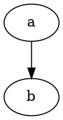
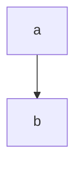

# Roundtrip Fixture

| Signal            | Width | Description        |
|-------------------|-------|--------------------|
| pmac_tx_tvalidchk | 1     | valid check        |
| clk               | 1     | clock              |

| A | B |
|---|---|
| x<br>y | z |



```verilog
module m; endmodule
```

```wavedrom
{ "signal": [{ "name": "clk", "wave": "p..." }] }
```



```
plain fence, no language tag
second line of plain text
```

- outer
  - inner 1
  - inner 2

> quote line

Line with trailing spaces  

See [[ref-1, §2]] for details.
No newline at EOF here